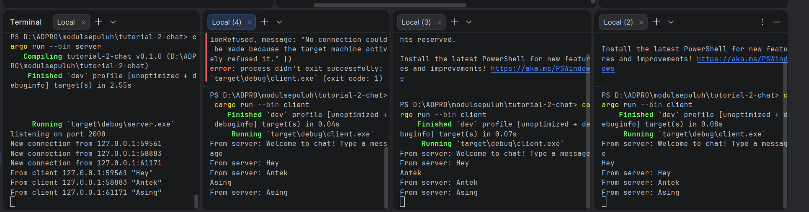
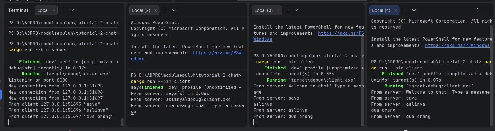
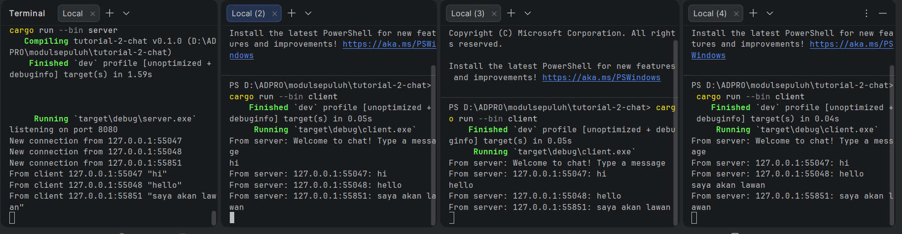

# Eksperimen 2.1: Original code, and how it run

**Cara Menjalankan:**
1. Buka satu terminal dan jalankan server dengan perintah `cargo run --bin server`. Server akan mendengarkan di port 2000.
2. Buka beberapa terminal baru sebagai client dan jalankan perintah `cargo run --bin client` di masing-masing terminal.
3. Ketik pesan di terminal client dan tekan Enter.

**Apa yang Terjadi:**
Ketika sebuah teks diketik di salah satu client, `tokio::io::stdin().lines()` akan menangkap input tersebut dan mengirimkannya ke server melalui websocket (`ws_stream.send`). Server yang menerima pesan tersebut di dalam fungsi `handle_connection` akan mengirimkan pesan itu ke *channel* `broadcast` tokio (`bcast_tx.send`). Karena setiap koneksi *client* memiliki *subscriber* (`bcast_rx`) ke *channel* yang sama, server akan secara otomatis menerima pesan dari *channel* tersebut lalu meneruskannya kembali ke seluruh *client* yang terhubung. Itulah sebabnya pesan muncul di layar semua *client*.

# Eksperimen 2.2: Modifying port

**Perubahan yang Dilakukan:**
Untuk mengubah port menjadi 8080, modifikasi dilakukan pada dua sisi karena koneksi WebSocket membutuhkan kecocokan antara alamat yang didengarkan (server) dan alamat yang dituju (client):
1. **Server (`src/bin/server.rs`)**: Mengubah argumen pada `TcpListener::bind("127.0.0.1:8080")` agar server mendengarkan koneksi masuk di port 8080.
2. **Client (`src/bin/client.rs`)**: Mengubah URI pada `ClientBuilder::from_uri(Uri::from_static("ws://127.0.0.1:8080"))` agar client mencoba menyambung ke port 8080.

**Protokol Websocket:**
Ya, aplikasi masih menggunakan protokol websocket yang sama. Protokol ini didefinisikan dengan skema `ws://` (yang merupakan singkatan dari WebSocket over HTTP) pada *string* URI di file client saat memanggil `Uri::from_static("ws://127.0.0.1:8080")`. Sedangkan di sisi server, protokol ini dikelola oleh fungsi `ServerBuilder::new().accept(socket)` yang melakukan proses *handshake* untuk meng- *upgrade* koneksi TCP biasa menjadi koneksi WebSocket.

# Eksperimen 2.3: Small changes. Add some information to client

**Penjelasan Perubahan:**
Untuk menambahkan informasi IP dan Port pengirim, saya melakukan modifikasi pada file `src/bin/server.rs`. Di dalam fungsi `handle_connection`, ketika server menerima pesan teks dari suatu client, server tidak lagi langsung mem-broadcast `text` mentah.

Sebagai gantinya, saya memformat pesan baru menggunakan `format!("{addr}: {text}")`, di mana `addr` adalah `SocketAddr` (IP dan Port) milik client pengirim yang didapat saat koneksi pertama kali diterima. Pesan yang sudah diformat inilah yang kemudian dikirim ke `bcast_tx` untuk disiarkan ke seluruh client.